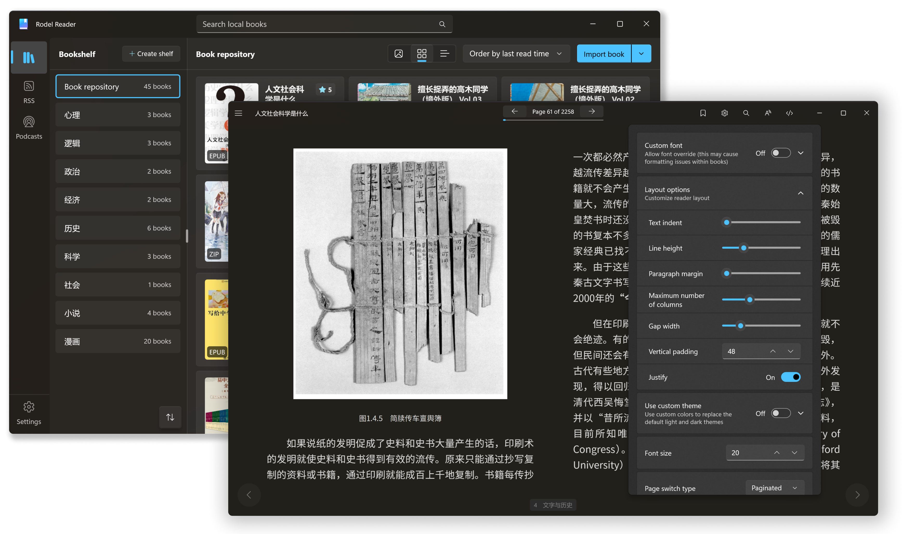

  

# Reader Copilot

`Reader Copilot` can read local txt, epub, and pdf, read online novels through plugins, and support RSS / Podcasts.

    <a title="Get From Microsoft Store" href="https://www.microsoft.com/store/apps/9PFZCKRHW0BC?launch=true&mode=full" target="_blank">
        <picture>
            <source srcset="https://get.microsoft.com/images/en-US%20light.svg" media="(prefers-color-scheme: dark)" />
            <source srcset="https://get.microsoft.com/images/en-US%20dark.svg" media="(prefers-color-scheme: light), (prefers-color-scheme: no-preference)" />
            
        </picture>
    </a>

<a href="#overview">Overview</a> &nbsp;&bull;&nbsp;
<a href="#platform">Platform</a> &nbsp;&bull;&nbsp;
<a href="#usage">Usage</a> &nbsp;&bull;&nbsp;
<a href="#data-collection">Data Collection</a>

## Overview

[Reader Copilot](https://www.microsoft.com/store/apps/9PFZCKRHW0BC) is a combination of Clean Reader and RSS Track.

Built using the Windows App SDK, it is a native Windows application designed for Windows 11. In addition to architectural updates, it also includes support for PDFs and podcasts.

By incorporating Fantasy Copilot as the AI core, features such as machine translation, natural voice reading, and semantic search have been added to create an artificial intelligence experience.

## Platform

Only available for Windows desktop environments.

Minimum supported version is Windows 10 ver.19041.

## Usage

Test plugins can be downloaded in [Releases](https://github.com/Richasy/ReaderCopilot.Public/releases) with the suffix `.rcpkg`.

For detailed usage instructions, please visit [Reader Copilot Document](https://readercopilot.richasy.com/docs)

## QQ Group

中文用户可以使用 QQ 群交流：**858688642**

## Screenshot

## Data Collection

Developers promise not to collect users' private data and will not use this application for commercial purposes.

Reader Copilot has added AppCenter as a data telemetry tool in order to understand the usage of certain features and make targeted adjustments in the future. The collected data does not contain any personal privacy information.

The application records errors during runtime, which are usually saved in local logs. Only when encountering uncaught errors and application crashes, this data will be uploaded to AppCenter for developers to analyze.
