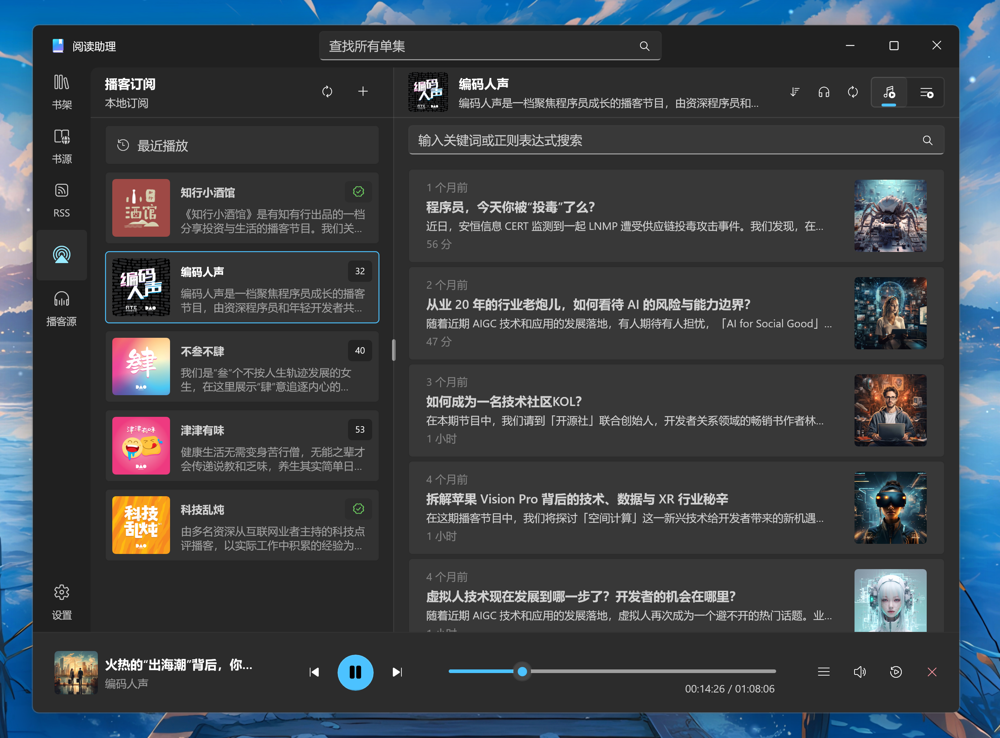

  

# 小幻阅读

> [!IMPORTANT]
> 小幻阅读已经进入下一个开发阶段，当前版本不再维护。代码锁定后，我将安装包公开出来，供喜欢旧版体验的用户下载安装。新版本请移步新仓库：[Rodel.Reader.Public](https://github.com/Richasy/Rodel.Reader.Public)

`小幻阅读` 可以阅读电子书，并支持 RSS / 播客。

<a href="#概述">概述</a> &nbsp;&bull;&nbsp;
<a href="#平台">平台</a> &nbsp;&bull;&nbsp;
<a href="#下载与安装">下载与安装</a> &nbsp;&bull;&nbsp;
<a href="#使用方法">使用方法</a>

## 概述

[小幻阅读](https://apps.microsoft.com/detail/9PFZCKRHW0BC) 是一款 Windows 桌面端阅读工具，通过遵循 Fluent Design 的用户界面，为您提供高品质的阅读体验。

它有三个主要功能板块：

- 📚 **电子书**
  支持 `TXT` / `EPUB` / `AZW3` / `MOBI` / `CBZ` / `FB2` / `PDF` / `ZIP(漫画)` 等多种电子书格式，满足常见的阅读需求。  
- 📰 **RSS**
  支持 `本地` / `Feedbin` / `Google Reader (API)` / `Inoreader` / `Miniflux` / `NewsBlur` 等服务。  
- 📻 **播客**
  可以在应用内浏览 `iTunes` 播客榜单，并支持订阅 `哔哩哔哩` 账号，将 B 站视频转为播客订阅。  

小幻阅读力求开箱即用，但部分服务可能需要您自行配置。

- 🤖 **AI 服务**
  小幻阅读可以通过 AI 进一步提升阅读效率，支持近 20 种本地或在线 AI 对话接口，包括 `OpenAI` 和 `Ollama`。但您需要提供相应的配置信息。具体配置方法请参考 [Rodel Agent | 对话服务配置](https://agent.richasy.net/chat-config)  
- 🌏 **翻译服务**
  小幻阅读支持文本翻译和全文翻译（仅 RSS）。如需使用这些功能，需要提供相应的翻译服务配置。具体配置信息请参考 [Rodel Agent | 机器翻译服务配置](https://agent.richasy.net/translate-config)  
- 🎙️ **文本转语音**
  小幻阅读集成了本地语音生成服务和 Edge 语音生成服务，同时也提供了额外的文本转语音服务配置。可参考 [Rodel Agent | 文本转语音服务配置](https://agent.richasy.net/tts-config)  

## 平台

仅适用于 Windows 桌面环境。

最低支持 Windows 10 ver.19041。

## 下载与安装

本应用以旁加载（Sideload）的 Windows App SDK (MSIX) 包形式分发。请按照以下步骤安装。

### 1. 下载安装包

前往 [Releases](https://github.com/Richasy/ReaderCopilot.Public/releases) 页面，下载与您电脑 CPU 架构匹配的 zip 文件：

| 架构                                  | 文件                                 |
| ------------------------------------- | ------------------------------------ |
| Intel / AMD（大多数电脑）             | `ReaderCopilot_2.2512.1.0_x64.zip`   |
| ARM64（如 Surface Pro X、骁龙笔记本） | `ReaderCopilot_2.2512.1.0_arm64.zip` |

> **不确定选哪个？** 按 `Win + I` 打开设置 → 系统 → 关于，查看 **系统类型**。如果显示"基于 x64 的处理器"，下载 x64 版本；如果显示"基于 ARM 的处理器"，下载 ARM64 版本。

### 2. 解压 zip 文件

右键点击下载的 zip 文件，选择 **全部解压...**，然后选择一个位置（例如桌面）。

解压后，您会看到三个文件：

| 文件                                               | 说明                               |
| -------------------------------------------------- | ---------------------------------- |
| `ReaderCopilot.UI_2.2512.1.0_x64.cer`（或 arm64）  | 安全证书                           |
| `ReaderCopilot.UI_2.2512.1.0_x64.msix`（或 arm64） | 应用安装包                         |
| `Microsoft.WindowsAppRuntime.1.8.msix`             | Windows App SDK 运行时（必需依赖） |

### 3. 安装证书

在安装应用之前，您需要先信任签名证书。

1. 双击 `.cer` 证书文件。
2. 点击 **安装证书...**。
3. 选择 **本地计算机**，然后点击 **下一步**（可能会弹出 UAC 对话框，点击 **是**）。
4. 选择 **将所有的证书都放入下列存储**，然后点击 **浏览...**。
5. 选择 **受信任的根证书颁发机构**，点击 **确定**，然后依次点击 **下一步** 和 **完成**。
6. 看到提示导入成功即可。

### 4. 安装 Windows App SDK 运行时

双击 `Microsoft.WindowsAppRuntime.1.8.msix`，按照提示完成安装。如果您的系统中已经安装过，可以跳过此步骤。

### 5. 安装应用

双击 `.msix` 文件（例如 `ReaderCopilot.UI_2.2512.1.0_x64.msix`），会弹出安装对话框，点击 **安装** 即可。安装完成后，应用会自动启动。

## 使用方法

详细的使用说明请访问 [小幻阅读文档](https://reader.richasy.net/)

## 截图

